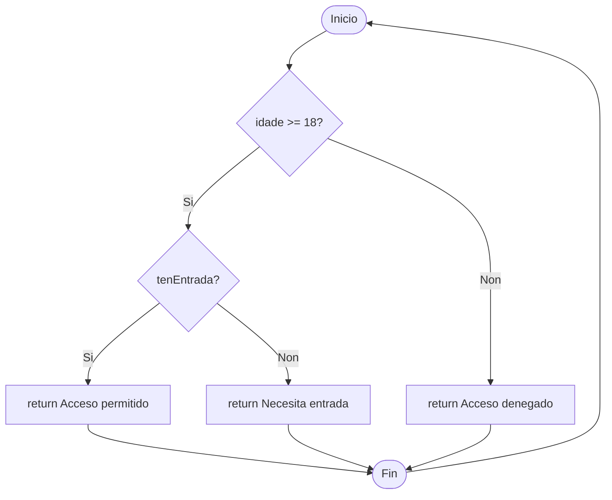

# Exercicio 4: Complexidade ciclomática

O proxecto ten unha clase permite comprobar o acceso dun usuario.

O diagrama asociado ao método comprobarAcceso é o seguinte:

## Tarefas

1. Utiliza unha das fórmulas para calcular a complexidade ciclomática.

2. Diseña tantas probas como che indique a complexidade ciclomática.

3. Entrega:

- Captura das probas en /docs.
- Captura da cobertura do 100% en /docs.
- Explicación do feito no explicacion.md en /docs.